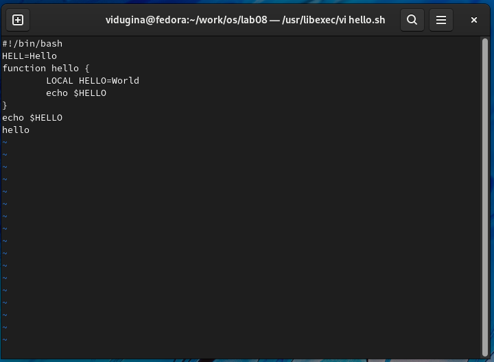
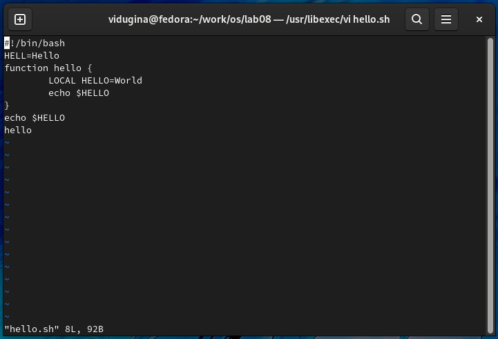

## **Отчёт по лабораторной работе №8**
#### **Дугина Виктория Игоревна**
**Цель работы**: познакомиться с операционной системой Linux. Получить практические навыки работы с редактором vi,
установленным по умолчанию практически во всех дистрибутивах.
### **Выполнение работы**

#### **Задание 1. Создание нового файла с использованием vi**

#### 1. Создайте каталог с именем ~/work/os/lab08.
Используя команду mkdir, создаём новый каталог.

<em>Рис 1</em>

#### 2. Перейдите во вновь созданный каталог.

Используя команду cd, переходим в новый каталог.

<em>Рис 2</em>

#### 3. Вызовите vi и создайте файл hello.sh.

Используя команду vi, создаём и открываем новый файл hello.sh.

<em>Рис 3</em>

#### 4. Нажмите клавишу "i" и вводите следующий текст.
Нажимаем i, чтобы вставить текст перед курсором.

<em>Рис 4</em>

#### 5. Нажмите клавишу "Esc" для перехода в командный режим после завершения ввода текста.
Нажимаем Esc, переходя в командный режим (заметно по отсутствию INSERT).

<em>Рис 5</em>

#### 6. Нажмите ":" для перехода в режим последней строки и внизу вашего экрана появится приглашение в виде двоеточия.
Нажимаем :, переходя в режим последней строки (заметно по : внизу).

<em>Рис 6</em>

#### 7. Нажмите "w" (записать) и "q" (выйти), а затем нажмите клавишу "Enter" для сохранения вашего текста и завершения работы.
Вводим wq, чтобы записать материал и выйти по нажатию Enter.

<em>Рис 7</em>

#### 8. Сделайте файл исполняемым.
Используя команду chmod, делаем файл исполняемым.

<em>Рис 8</em>

#### **Задание 2. Редактирование существующего файла**

#### 1. Вызовите vi на редактирование файла.
Используя команду vi, открываем файл hello.sh.

<em>Рис 1</em>

#### 2. Установите курсор в конец слова HELL второй строки.
Используя команды 2G (перемещение на 2 строку) и w (перемещение на 1 слово), перемещаем курсор на нужное место.

<em>Рис 2</em>

#### 3. Перейдите в режим вставки и замените на HELLO. Нажмите "Esc" для возврата в командный режим

Нажимаем i, чтобы перейти в режим вставки, и заменяем HELL на HELLO. После возвращаемся в командный режим (Esc).

<em>Рис 3</em>

#### 4. Установите курсор на четвертую строку и сотрите слово LOCAL.

Переходим на 4 строку, используя команду 4G. Нажимаем i, чтобы перейти в режим вставки, и стираем LOCAL. После возвращаемся в командный режим (Esc).

<em>Рис 4</em>

#### 5. Перейдите в режим вставки и наберите следующий текст: local, нажмите "Esc" для возврата в командный режим.

Нажимаем i, чтобы перейти в режим вставки, и вводим local. После возвращаемся в командный режим (Esc).

<em>Рис 5</em>

#### 6. Установите курсор на последней строке файла. Вставьте после неё строку, содержащую следующий текст: echo $HELLO.
Переходим на последнюю строку, используя команду G. После переходим в режим вставки (i) и вводим "echo $HELLO".

<em>Рис 6</em>

#### 7. Нажмите "Esc" для перехода в командный режим.
Нажимаем Esc.

<em>Рис 7</em>

#### 8. Удалите последнюю строку. 
Удаляем последнюю строку, используя команду dd.

<em>Рис 8</em>

#### 9. Введите команду отмены изменений "u" для отмены последней команды.
Используем команду u, отменяя последнюю команду (удаление строки).

<em>Рис 9</em>

#### 10. Введите символ ":" для перехода в режим последней строки. Запишите произведённые изменения и выйдите из vi.
Вводим wq, чтобы записать материал и выйти по нажатию Enter.

<em>Рис 10</em>

**Вывод**: я познакомилась с операционной системой Linux. Получила практические навыки работы с редактором vi,
установленным по умолчанию практически во всех дистрибутивах.

### **Контрольные вопросы**
#### 1. Дайте краткую характеристику режимам работы редактора vi.
#### 2. Как выйти из редактора, не сохраняя произведённые изменения?
#### 3. Назовите и дайте краткую характеристику командам позиционирования.
#### 4. Что для редактора vi является словом?
#### 5. Каким образом из любого места редактируемого файла перейти в начало (конец) файла?
#### 6. Назовите и дайте краткую характеристику основным группам команд редактирования.
#### 7. Необходимо заполнить строку символами $. Каковы ваши действия?
#### 8. Как отменить некорректное действие, связанное с процессом редактирования?
#### 9. Назовите и дайте характеристику основным группам команд режима последней строки.
#### 10. Как определить, не перемещая курсора, позицию, в которой заканчивается строка?
#### 11. Выполните анализ опций редактора vi (сколько их, как узнать их назначение и т.д.).
#### 12. Как определить режим работы редактора vi?
#### 13. Постройте граф взаимосвязи режимов работы редактора vi.
